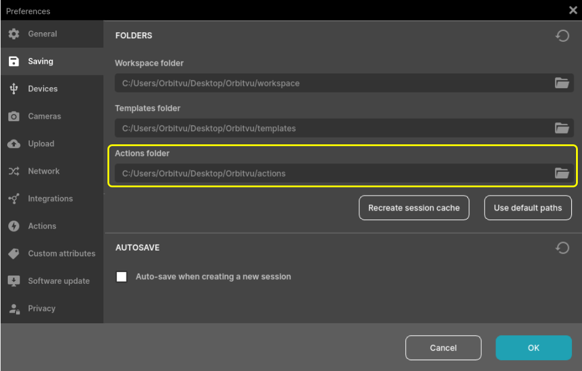
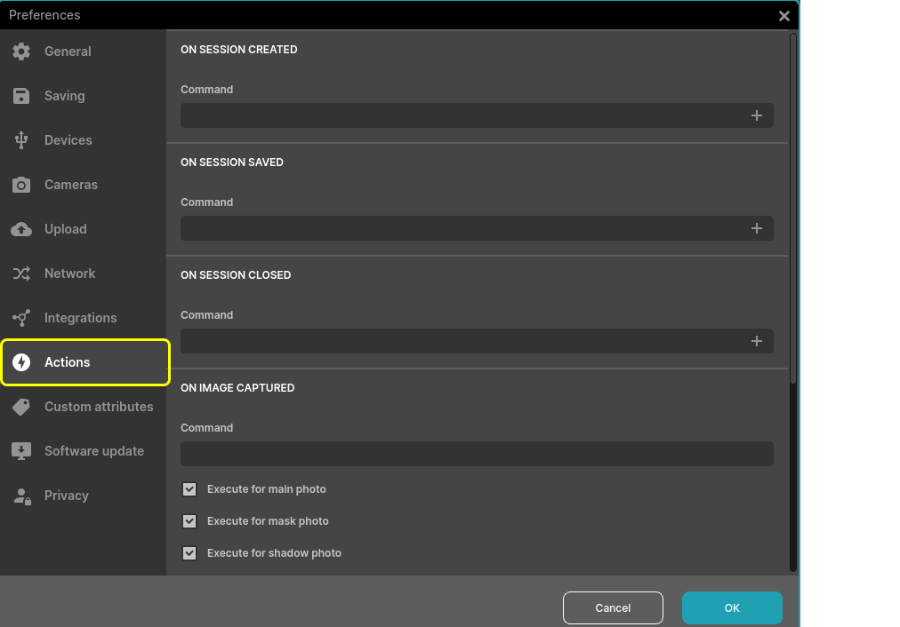
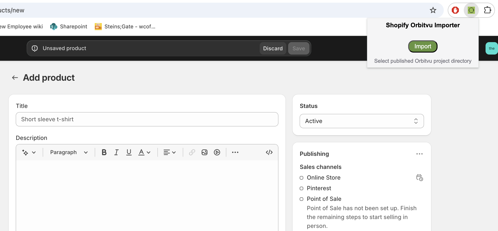

# shopify-orbitvu-importer
Simple uploader for orbitvu project to Shopify

## Setup
Various setup is needed to integrate Orbitvu with Shopify.

### Orbitvu Station
Within Orbitvu Station:
- Determine the location where 'actions' are stored. This can be found under Preferences > Saving > "Actions folder".

- Copy `EXPORT_SESSION_DATA.js` into the actions folder.
- Enable the action in Orbitvu Station under Preferences > Actions > "On publish started".

### Browser
This is still in development, so extension needs to be ran in developer mode.

- Clone repo locally, or download and extract ZIP.
- In chrome browser, navigate to `chrome://extensions/`
- In top right, enable "Developer mode"
- In top left, click "Load unpacked"
- Select the location to this repo (shopify-orbitvu-importer)

## Usage
From Shopify New Product page, click the extension icon to start importing.

## Todo List
A lot still needs to be done...
- Documentation
- Make things more configurable/extensible
- Productize proof-of-concept
