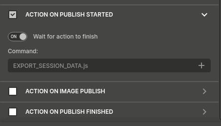

# shopify-orbitvu-importer
Simple uploader for Orbitvu project to Shopify

## Setup
Various setup is needed to integrate Orbitvu with Shopify.

### Download
It is recommended to clone the repo using `git` or GitHub:
```
git clone https://github.com/codambro/shopify-orbitvu-importer
```
This makes it easy to update to the latest version using `git pull`. Alternatively, a ZIP file can be downloaded from GitHub and extracted locally. However, this means that updating will require re-downloading the latest ZIP file.


### Orbitvu Station
Within Orbitvu Station:
- Determine the location where 'actions' are stored. This can be found under Preferences > Saving > "Actions folder". Note, do NOT change the setting!

- Copy `EXPORT_SESSION_DATA.js` into the actions folder.
- Enable the action in Orbitvu Station within the specific publishing profile under "ACTION ON PUBLISH STARTED".


### Browser
This is still in development, so extension needs to be ran in developer mode.

- In Chrome browser, navigate to `chrome://extensions/`. In Edge browser, navigate to `edge://extensions/`.
- Enable "Developer mode". This is in the top-right in Chrome, or bottom-left in Edge.
- At the top, click "Load unpacked"
- Select the location to this repo (shopify-orbitvu-importer)


### Configure
Custom options can be configured in the browser by right-clicking the extension icon and selecting "Options" (in Edge this is "Extension options"). Here custom metadata fields can be configured, mapping custom Orbitvu fields to custom Shopify fields.


## Usage
From the "Add New Product" page in Shopify, click the extension icon to start importing. Select the folder containing the published Orbitvu project.

